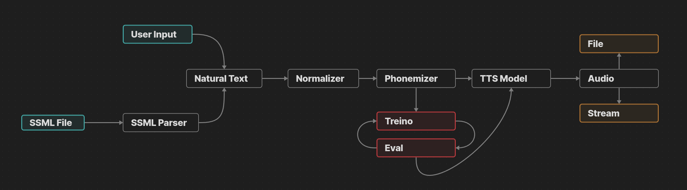
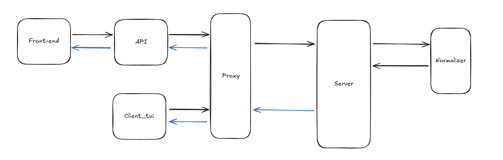

     

# PI24 - Real-Time Speech Synthesis

**Authors:**

- [Beatriz Monteiro](https://github.com/5ditto)
- [Daniel Du](https://github.com/ddu72)
- [Daniel Furtado](https://github.com/danielfurtado11)
- [Miguel Gomes](https://github.com/MayorX500)
- [Moisés Antunes](https://github.com/MoisesA14)
- [Telmo Maciel](https://github.com/telmomaciel9)

## A better version of the Documentation can be found [here](https://mayorx500.github.io/VoiceSynth-Agentifai/)

## Description

This project aims to create a text-to-speech system that can be used in real-time. The system is divided into three main components: the client, the proxy, and the server. The client is responsible for sending the text to be synthesized to the proxy. The proxy is responsible for redirecting the requests to the available servers. The server is responsible for normalizing the text, synthesizing it and sending the audio back to the client.
The project was proposed by the company Agentifai and was being developed by a group of students from the University of Minho.

## Basic App Flow

The Text-to-Speech (TTS) system follows a modular pipeline to convert input text or Speech Synthesis Markup Language (SSML) into audio files or real-time streams. Below is a description of the key components and their roles in the process:

1. User Input or SSML File:

   Users can provide natural text or structured SSML files. However, due to limitations in supporting SSML files, this functionality has not been implemented. Currently, the system only processes natural text inputs.

2. SSML Parser:

   (Not implemented) This component was intended to extract relevant text data from SSML files and prepare it for further processing.

3. Normalizer:

   The normalizer standardizes the input text (e.g., expanding abbreviations, handling numbers) to ensure it is ready for phonemization.

4. Phonemizer:

   The phonemizer converts normalized text into phonetic representations, enabling accurate pronunciation during synthesis. This component is also subject to training and evaluation cycles to improve accuracy and performance.

5. TTS Model:

   The text's phonetic representation is passed to the TTS model, which generates audio output. The model has been optimized for both file-based outputs and real-time streaming scenarios.

6. Audio Output:

   The generated audio can be delivered as a downloadable file or streamed directly, depending on user requirements.

The system's modular architecture ensures flexibility, enabling enhancements to individual components without disrupting the entire workflow. While SSML support was initially planned, the current implementation focuses solely on natural text processing.

## Components

### Client

The client is a simple TUI program that sends the text to be synthesized to the proxy. It is implemented in Python.

### Proxy

The proxy receives the text to be synthesized from the client and redirects it to the available servers. It is implemented in Python.

### Server

The server receives the text to be synthesized from the proxy, sends it to be normalized, receives the normalized text, synthesizes it and sends the audio back to the client. It is implemented in Python.

### Normalizer

The normalizer receives the text to be synthesized from the server, normalizes it and sends it back to the server. It is implemented in Python.

### API & Frontend

The API is responsible for receiving the text to be synthesized and returning the audio. The frontend is a simple web interface that allows the user to interact with the API.

## Architecture

The system was implemented using a microservices architecture. Each component is a separate service that communicates with the others using gRPCs. Each component is implemented in Python and is dockerized.

The black arrows represent the flow of the text to be synthesized. The blue arrows represent the flow of the audio.

## Requirements

- Python 3.12
- Docker
- Docker Compose

## Installation

### Standalone Program

This allows the user to synthesize text using the Intelex Module. This version is a standalone (Single Service) version of the implementation.

#### Steps

1. Install the requirements: `pip install -r enviroments/server_requirements.txt`
2. Run the program: `python intlex.py [TEXT] [CONFIG] --output [OUTPUT] --lang [LANG] --kwargs [KWARGS]`
3. The output will be saved in the output file if provided, otherwise it will be stored in the default output file.

##### Arguments

- `TEXT`: Text to be synthesized
- `CONFIG`: Configuration file
- `OUTPUT`: Output file (optional)
- `LANG`: Language [pt, en] (optional)
- `KWARGS`: Additional arguments (optional)

### Docker

This allows the user to synthesize text using the Intelex Program. This version is a dockerized version of the implementation. It uses a microservices architecture.

#### Steps

1. Build the docker images:

   `docker compose build`

2. Initialize proxy and required services:

   `docker compose up proxy -d`

3. Initialize the client:

   `docker compose run -e PROXY_SERVER_PORT={PROXY_SERVER_PORT} -e PROXY_SERVER_ADDRESS={PROXY_SERVER_ADDRESS} client`

4. The output will be displayed in the terminal.

- To stop the services:
  `docker compose down`

## Improvements

##### General

- [TODO] Tests
- [TODO] Documentation
- [TODO] More languages

##### Client

- [TODO] Voice option in client
- [TODO] Better user interface

##### Proxy

- [FIX] Prints in proxy
- [TODO] Logfile

##### Server

- [TODO] Logfile

##### Normalizer

- [TODO] Logfile

##### API & Frontend

- [FIX] Not connecting using Docker
