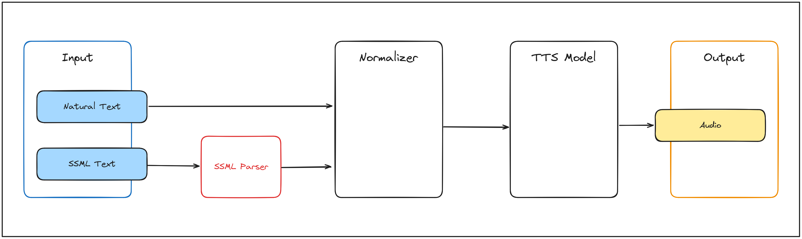

# Flow
The system, as designed, is composed of several components, each responsible for a specific task. 

## App Flow

Based on the [architecture diagram](architecture.md#architecture-image), the flow of the system is as follows:

#### Frontend API flow:
- The user interacts with the system through the [Frontend](components/app.md), which sends requests to the `API`.

- The [API](components/app_api.md) processes the requests and sends them to the `Proxy`.

- The [Proxy](components/app_proxy.md) routes the requests to an available `Server`.

- The [Server](components/app_server.md) sends the text input to the `Normalizer`.

- The [Normalizer](components/app_normalizer.md) processes the input and prepares it for synthesis and sends it back to the `Server`.

- The [Server](components/app_server.md) uses the normalized text to generate the audio. Then sends it back to the `Proxy`.

- The [Proxy](components/app_proxy.md) returns the results to the `API`.

- The [API](components/app_api.md) sends the results back to the `Frontend`, which displays the results to the user.

#### Client flow: 
- The user interacts with the system through the [Client](components/app_client.md) , which sends requests directly to the `Proxy`.

- The [Proxy](components/app_proxy.md) routes the requests to an available `Server`.

- The [Server](components/app_server.md) sends the text input to the `Normalizer`.

- The [Normalizer](components/app_normalizer.md) processes the input and prepares it for synthesis and sends it back to the `Server`.

- The [Server](components/app_server.md) uses the normalized text to generate the audio. Then sends it back to the `Proxy`.

- The [Proxy](components/app_proxy.md) returns the results to the `Client`.

- The [Client](components/app_client.md) displays the results to the user.

## Data Flow

 The flow of data between these components is crucial for the system to function correctly. The following diagram illustrates the flow of data between the components of the system:

As the diagram shows, the data flow is as follows:

#### 1. Input:

The system accepts two types of inputs:

- Natural Text: Plain text provided by the user.

- SSML Text: Structured input using Speech Synthesis Markup Language (not currently implemented).

#### 2. Normalizer:

The input text is sent to the Normalizer, which standardizes it for further processing. For example:
- Expanding abbreviations.
- Converting numbers into words.

#### 3. TTS Model:

The normalized text is then processed by the TTS Model, which converts the text into audio data. This includes:
- Generating phonetic representations.
- Applying prosody to ensure naturalness.

#### 4. Output:

The audio data is finalized and saved as an output file (e.g., .wav or .mp3), ready for playback and/or further processing.

### Current Limitations

**SSML Support**: While the diagram includes an SSML Parser, this functionality is not yet implemented. All inputs must currently be provided as plain text.

**Streaming**: The system generates complete audio files and sends them directly to the user, but streaming capabilities could be added in future iterations.

## Communication
### Main Components Communication

To handle the comunications between the main components, the system uses `gRPC` as the communication protocol. This allows for fast and efficient communication between the components, ensuring that the system can handle the real-time requirements of the audio synthesis process.

The use of `gRPC` also allows for a technology-agnostic approach to the system, as it can be used with a wide variety of programming languages and platforms.

### Frontend API Communication
To handle the communication between the **Frontend** and the **API**, the system uses `HTTP` as the communication protocol. This allows for easy integration with web-based applications and ensures that the system can be easily accessed by a wide variety of devices.