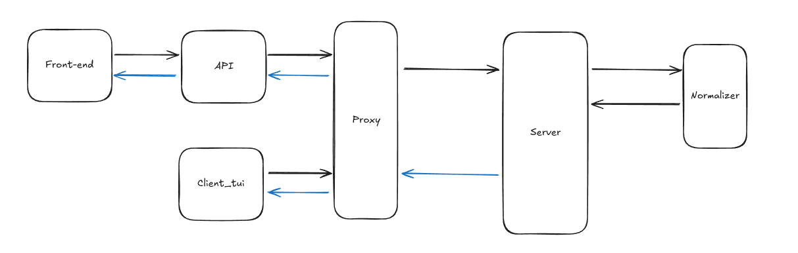

# Architecture

The system was designed to be simple, modular, and scalable. The architecture is based on a microservices approach, with each component responsible for a specific task. This allows for easy integration of new components and updates on existing ones. The system is designed to be able to run on a large variety of hardware, from small devices to large cloud servers.

In the diagram above, it is possible to see the main components of the system:
- **Black Arrows**: Represent the flow of "text" between the components.
- **Blue Arrows**: Represent the flow of audio between the components.
- **Components**:
    - [**Frontend**](components/app.md): The user interface, responsible for sending requests to the api and displaying the results.
    - [**API**](components/app_api.md): One of the possible interfaces of the system, responsible for processing requests from the frontend and sending them to the server.
    - [**Client**](components/app_client.md): The client is a Terminal-based interface that allows users to interact with the system without being dependent on the API.
    - [**Proxy**](components/app_proxy.md): The proxy is responsible for routing requests to the server and returning the results to the client and/or API.
    - [**Server**](components/app_server.md): The server is responsible for processing requests from the proxy and generating the audio output.
    - [**Normalizer**](components/app_normalizer.md): The normalizer is responsible for processing the input text and preparing it for synthesis.

## Docker

Each component is incapsulated in a Docker container, allowing for easy deployment and scaling. The provided docker-compose file allows for easy deployment of the system on a single machine.