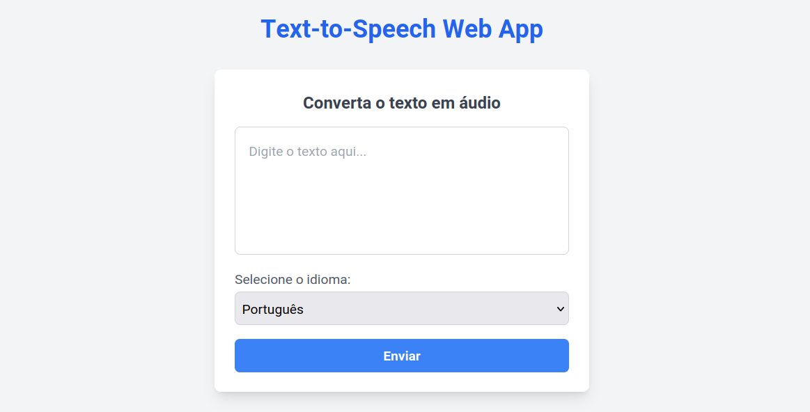

## Frontend

The frontend is the user interface of the application. It is responsible for rendering the user interface and handling user interactions. The frontend is built using React.

### Requirements

The frontend requires the following:

- ENV: The environment variables must be defined in the `.env` file or as environment variables. The following variables must be defined:
    - `PORT`: The port on which the frontend will run.
    - `REACT_APP_API_IP_PORT`: The port of the API server.
    - `REACT_APP_API_IP_ADDRESS`: The address of the API server.

- Dependencies: The frontend requires the following dependencies:
    - [Node.js](https://nodejs.org/en/)
    - [npm](https://www.npmjs.com/get-npm)
    - [axios](https://www.npmjs.com/package/axios)
    - [react-audio-player](https://www.npmjs.com/package/react-audio-player)

### Usage

To run the frontend, you can do the following:

1. Define the api address and port in the `.env` file or as an environment variable. The serve port can also be defined. For example:
    ```bash
    export PORT=3000
    export REACT_APP_API_IP_PORT=5000
    export REACT_APP_API_IP_ADDRESS={api_address}
    ```
2. Install the required dependencies by running:
    ```bash
    cd app
    npm install
    ```
3. Start the frontend by running:
    ```bash
    cd app
    npm start
    ```
The frontend will be available at `http://localhost:3000`.

### Comunication

The frontend communicates with the API to send the text to be synthesized and receive the audio file. The API is responsible for processing the text and generating the audio file.

The frontend sends a POST request to the API with the text to be synthesized. The API processes the request and when completed, the audio file is sent to the frontend. The frontend then receives the audio file and displays it to the user.

##### Request

```json
{
    "text":"O exame de Época Especial realiza-se no dia 10 de Julho, às 9:00, na sala Ed.2 1.03.",
    "language":"pt"
}
```

##### Response

```json
[BINARY DATA]
```

### Aspect

The frontend is composed of only one page, which contains the text input and the audio player. The user can input the text to be synthesized and click the "Enviar" button to generate the audio file. The audio player will display the audio file and allow the user to play, pause, and stop the audio.




