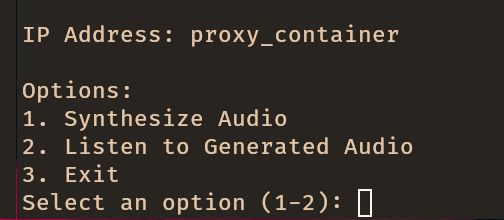
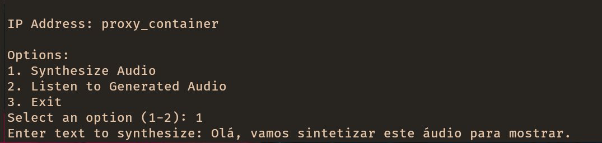
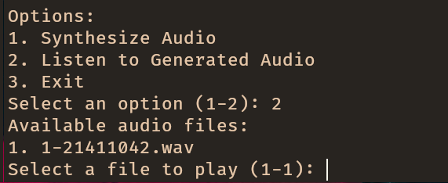

## Client

The client is the user interface of the application. It is a terminal-based application that allows users to interact with the system. The client is responsible for sending requests directly to the Proxy and displaying the responses to the user.

### Functionality

The client provides the following functionality:

- **User authentication**: The client allows users to log in to the system using their `token`.

- **User interaction**: The client provides a command-line interface for users to interact with the system. Users can send requests to the Proxy and receive responses.

- **Response display**: The client displays the responses received from the Proxy in a user-friendly format.

### Implementation

The client is a rudimentary terminal-based application made in Python. It reads user input from the command line, sends requests to the Proxy, and displays the responses to the user. The client uses the `grpc` library to communicate with the Proxy using gRPC.

The client is a standalone component that can be run on any machine with Python installed. It requires only the `grpcs` module/folder to be present in the same directory.

### Requirements

The client requires the following dependencies:
- Python 3.12 or higher
- [Python packages](../../../enviroments/client_requirements.txt)

### Usage

To run the client, follow these steps:

1. Clone the repository:
   ```bash
   git clone https://github.com/ddu72/PI
   ```
2. Define the environment variables:
   ```bash
   export USER_TOKEN={user_token}
   export PROXY_SERVER_PORT={proxy_host}
   export PROXY_SERVER_ADDRESS={proxy_port}
   ```
3. Install the required packages:
   ```bash
   pip install -r environments/client_requirements.txt
   ```
4. Run the client:
   ```bash
    python app_client
    ```
5. Follow the instructions displayed on the terminal to interact with the system.

### Aspect






